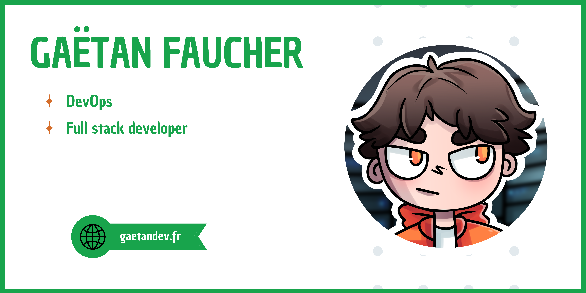

#  Hey, welcome to my page !  

My name is **Gaëtan**, I'm a **French full stack developer** & a **DevOps engineer enthusiast**. Passionate about **automation, cloud solutions, and software development**, I love experimenting with new technologies.  

Currently using [Jetbrains](https://www.jetbrains.com/) tools, mainly working on a **[Macbook Pro M2](https://www.apple.com/fr/macbook-pro/)** but also on a dual boot **[Manjaro](https://manjaro.org/) x [Windows](https://www.microsoft.com/en-us/windows/)**.  

# Tech Stack  
### 🌐 Frontend & Backend  
- **Frameworks**: [Svelte](https://svelte.dev/) / [Angular](https://angular.io/)  
- **Languages**: [TypeScript](https://www.typescriptlang.org/), [C#](https://docs.microsoft.com/en-us/dotnet/csharp/), [Java](https://www.java.com/), [Kotlin](https://kotlinlang.org/), [Dart](https://dart.dev/)  
- **Low-Level**: [Go](https://golang.org/), [C](https://fr.wikipedia.org/wiki/C_(langage)), [C++](https://fr.wikipedia.org/wiki/C++)

### ⚡ DevOps & Cloud  
- **Cloud Providers**: [AWS](https://aws.amazon.com/), [GCP](https://cloud.google.com/), [OVH](https://www.ovh.com/)  
- **Monitoring**: [Prometheus](https://prometheus.io/), [Grafana](https://grafana.com/), [Datadog](https://www.datadoghq.com/)  
- **Virtualization**: [VMware](https://www.vmware.com/), [Proxmox](https://www.proxmox.com/), [Unraid](https://unraid.net/)  
- **Containers & Orchestration**: [Docker](https://www.docker.com/), [Kubernetes](https://kubernetes.io/)  
- **Infrastructure as Code**: [Terraform](https://www.terraform.io/), [Ansible](https://www.ansible.com/)

# Where to find me ?

# Stats

